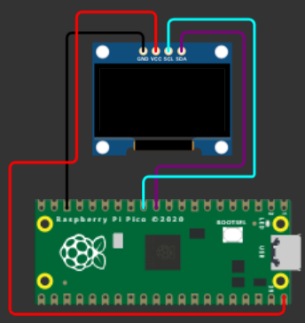

)
# **Tecnológico Nacional de México**
# **Instituto Tecnológico de Tijuana**
# **Subdirección Académica**
# **Depto de Sistemas y Computación**
# **SEMESTRE: AGOSTO – DICIEMBRE 2023**
# **Ing. En Sistemas Computacionales**
# **SISTEMAS PROGRAMABLES 23a**
# **Estevez Ramirez Maria Teresa - 20211773**
## FECHA: 10 de octubre del 2023

# **Impresiòn de texto en oled ssd1306**
## Código 
```python
import machine
import ssd1306
# Configura los pines SDA y SCL para la comunicación I2C
i2c = machine.I2C(0, sda=machine.Pin(8), scl=machine.Pin(9))

# Configura el objeto SSD1306 para la pantalla OLED
oled = ssd1306.SSD1306_I2C(128, 64, i2c)

# Limpia la pantalla
oled.fill(0)
oled.show()

# Dibuja "Hola Mundo" en la pantalla
oled.text("Hola Mundo", 0, 0)

# Actualiza la pantalla para mostrar el texto
oled.show() 
```
## Simulación del circuito

## Cuicuito
