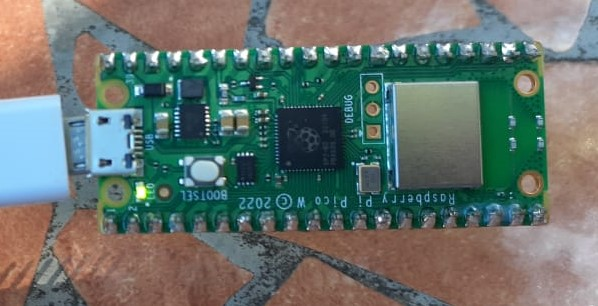
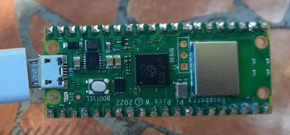
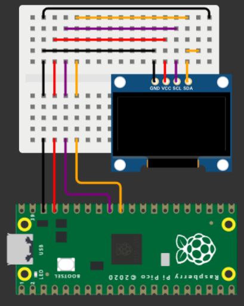

# **Tecnológico Nacional de México**
# **Instituto Tecnológico de Tijuana**
# **Subdirección Académica**
# **Depto de Sistemas y Computación**
# **SEMESTRE: AGOSTO – DICIEMBRE 2023**
# **Ing. En Sistemas Computacionales**
# **SISTEMAS PROGRAMABLES 23a**
# **Estevez Ramirez Maria Teresa - 20211773**
## FECHA: 10 de octubre del 2023

# **Impresiòn de texto en oled ssd1306**
## Código 
```python
import machine
import ssd1306
# Configura los pines SDA y SCL para la comunicación I2C
i2c = machine.I2C(0, sda=machine.Pin(8), scl=machine.Pin(9))

# Configura el objeto SSD1306 para la pantalla OLED
oled = ssd1306.SSD1306_I2C(128, 64, i2c)

# Limpia la pantalla
oled.fill(0)
oled.show()

# Dibuja "Hola Mundo" en la pantalla
oled.text("Hola Mundo", 0, 0)

# Actualiza la pantalla para mostrar el texto
oled.show() 
```
## Simulación del circuito

## Curcuito


# Blink pico w
## Código
```python
from machine import Pin
from utime import sleep

led = machine.Pin("LED", machine.Pin.OUT)

while True:
    led.toggle()
    sleep(0.5)
```
## Simulación del circuito


## Curcuito

> LED encendido


> LED apagado

# Logo de ISC
## Código
```python
#Estevez Ramirez Maria Teresa - 20211773

from machine import Pin, I2C
from ssd1306 import SSD1306_I2C
import framebuf, sys
import utime

def init_i2c(scl_pin, sda_pin):
    # Initialize I2C device
    i2c_dev = I2C(1, scl=Pin(scl_pin), sda=Pin(sda_pin), freq=200000)
    i2c_addr = [hex(ii) for ii in i2c_dev.scan()] 
    if not i2c_addr:
        print('No I2C Display Found')
        sys.exit()
    else:
        print("I2C Address      : {}".format(i2c_addr[0]))
        print("I2C Configuration: {}".format(i2c_dev))
    return i2c_dev

i2c = machine.I2C(0, sda=machine.Pin(8), scl=machine.Pin(9), freq=400000)
oled = SSD1306_I2C(128,64,i2c)

plan_b = [
0x00, 0x00, 0x00, 0x00, 0x00, 0x00, 0x00, 0x00, 0x00, 0x00, 0x00, 0x00, 0x00, 0x00, 0x00, 0x00, 
0x00, 0x00, 0x00, 0x00, 0x00, 0x00, 0x03, 0x80, 0x00, 0x0f, 0x00, 0x00, 0x00, 0x00, 0x00, 0x00, 
0x00, 0x00, 0x00, 0x00, 0x00, 0x01, 0xff, 0xc0, 0x00, 0x1f, 0xfc, 0x00, 0x00, 0x00, 0x00, 0x00, 
0x00, 0x00, 0x00, 0x00, 0x00, 0x03, 0xff, 0xc0, 0x00, 0x3f, 0xfe, 0x00, 0x00, 0x00, 0x00, 0x00, 
0x00, 0x00, 0x00, 0x00, 0x00, 0x01, 0xff, 0xe0, 0x00, 0x3f, 0xfc, 0x00, 0x00, 0x00, 0x00, 0x00, 
0x00, 0x00, 0x00, 0x00, 0x00, 0x01, 0xff, 0xe0, 0x00, 0x7f, 0xf8, 0x00, 0x00, 0x00, 0x00, 0x00, 
0x00, 0x00, 0x00, 0x00, 0x00, 0x01, 0xff, 0xf0, 0x00, 0x7f, 0xf8, 0x00, 0x00, 0x00, 0x00, 0x00, 
0x00, 0x00, 0x00, 0x00, 0x00, 0x00, 0xff, 0xff, 0xff, 0xff, 0xf8, 0x00, 0x00, 0x00, 0x00, 0x00, 
0x00, 0x00, 0x00, 0x1e, 0x00, 0x00, 0xff, 0xff, 0xff, 0xff, 0xf8, 0x00, 0x07, 0xe0, 0x00, 0x00,
0x00, 0x00, 0x00, 0x7f, 0x80, 0x03, 0xff, 0xff, 0xff, 0xff, 0xff, 0x00, 0x1f, 0xf8, 0x00, 0x00, 
0x00, 0x00, 0x00, 0xff, 0xe0, 0x1f, 0xff, 0xfe, 0xdb, 0x79, 0xff, 0xf0, 0xff, 0xfc, 0x00, 0x00, 
0x00, 0x00, 0x03, 0xff, 0xfc, 0xff, 0xff, 0xb7, 0x7f, 0xf3, 0xff, 0xff, 0xff, 0xfe, 0x00, 0x00, 
0x00, 0x00, 0x01, 0xff, 0xff, 0xfe, 0x1f, 0xff, 0xff, 0xff, 0xfd, 0xff, 0xff, 0xf8, 0x00, 0x00, 
0x00, 0x00, 0x00, 0xff, 0xff, 0xff, 0xff, 0xff, 0xff, 0xff, 0xfc, 0x7f, 0xff, 0xe0, 0x00, 0x00, 
0x00, 0x00, 0x00, 0x3f, 0xff, 0xef, 0xff, 0x80, 0x00, 0x07, 0xff, 0xef, 0xff, 0x80, 0x00, 0x00, 
0x00, 0x00, 0x00, 0x0f, 0xff, 0xff, 0xf0, 0x00, 0x00, 0x00, 0x3f, 0xff, 0xff, 0x00, 0x00, 0x00, 
0x00, 0x00, 0x00, 0x07, 0xff, 0xbf, 0x80, 0x1f, 0xff, 0xf0, 0x07, 0xff, 0x7f, 0x00, 0x00, 0x00, 
0x00, 0x00, 0x00, 0x0f, 0xff, 0xfc, 0x03, 0xff, 0xff, 0xff, 0x00, 0xff, 0xff, 0x80, 0x00, 0x00, 
0x00, 0x00, 0x00, 0x1f, 0xff, 0xf0, 0x1f, 0xfb, 0xef, 0x3f, 0xe0, 0x3f, 0xdf, 0xe0, 0x00, 0x00, 
0x00, 0x00, 0x00, 0x3f, 0xff, 0xc0, 0x7f, 0xf9, 0xcf, 0x3f, 0xfc, 0x0f, 0xff, 0xf0, 0x00, 0x00, 
0x00, 0x0e, 0x00, 0x7f, 0x9f, 0x01, 0xff, 0xfb, 0xef, 0x7f, 0xff, 0x07, 0xff, 0xf8, 0xff, 0xc0, 
0x00, 0x1f, 0xfc, 0xff, 0xfe, 0x07, 0xff, 0xe0, 0x00, 0x1f, 0xff, 0x81, 0xf3, 0xff, 0xff, 0xe0, 
0x00, 0x1f, 0xff, 0xfe, 0x3c, 0x0f, 0xff, 0x80, 0x00, 0x07, 0xff, 0xc0, 0xff, 0xff, 0xff, 0xe0, 
0x00, 0x3f, 0xff, 0xff, 0xf8, 0x1f, 0xff, 0x80, 0x00, 0x03, 0xff, 0xe0, 0x7f, 0x7f, 0xff, 0xf0, 
0x00, 0x3f, 0xff, 0xf9, 0xf0, 0x3f, 0xe1, 0x80, 0x00, 0x02, 0x1f, 0xf0, 0x3e, 0xff, 0xff, 0xf0, 
0x00, 0x3f, 0xff, 0xff, 0xf0, 0x7f, 0xff, 0x80, 0x00, 0x03, 0xff, 0xf8, 0x3f, 0xff, 0xff, 0x80, 
0x00, 0x03, 0xff, 0xf5, 0xe0, 0x7f, 0xe1, 0x80, 0x00, 0x03, 0x1f, 0xfc, 0x1f, 0xff, 0xe0, 0x00, 
0x00, 0x00, 0x0f, 0xff, 0xe0, 0x7f, 0xff, 0x80, 0x00, 0x03, 0xff, 0xfc, 0x1f, 0xff, 0x00, 0xc0, 
0x00, 0x00, 0x07, 0xf9, 0xe0, 0xff, 0xff, 0x81, 0x00, 0x03, 0xff, 0xfc, 0x1f, 0xff, 0x00, 0x18, 
0x00, 0x00, 0x07, 0xff, 0xe0, 0xff, 0xe1, 0x80, 0x00, 0x02, 0x1f, 0xfc, 0x1f, 0xff, 0xc0, 0x00,
0x00, 0x00, 0x07, 0xf3, 0xe0, 0xff, 0xff, 0x80, 0x00, 0x03, 0xff, 0xfc, 0x1f, 0xff, 0x81, 0x80, 
0x00, 0x00, 0x07, 0xe5, 0xe0, 0xff, 0xff, 0x80, 0x00, 0x03, 0xff, 0xfc, 0x1f, 0xff, 0x80, 0x00, 
0x00, 0x00, 0x07, 0xff, 0xe0, 0x7f, 0xe0, 0x80, 0x00, 0x02, 0x0f, 0xfc, 0x1f, 0xff, 0x83, 0x00, 
0x00, 0x00, 0x07, 0xff, 0xe0, 0x7f, 0xff, 0x80, 0x00, 0x03, 0xff, 0xf8, 0x1f, 0xff, 0xf8, 0x00, 
0x00, 0x01, 0xff, 0xff, 0xf0, 0x3f, 0xff, 0x80, 0x00, 0x03, 0xff, 0xf8, 0x3f, 0xff, 0xff, 0xe0, 
0x00, 0x3f, 0xff, 0xff, 0xf0, 0x1f, 0xe1, 0x80, 0x00, 0x02, 0x0f, 0xf0, 0x3f, 0xff, 0xff, 0xf0, 
0x00, 0x3f, 0xff, 0xff, 0xf8, 0x0f, 0xff, 0x80, 0x00, 0x03, 0xff, 0xe0, 0x7f, 0xff, 0xff, 0xf0, 
0x00, 0x3f, 0xff, 0xff, 0xfc, 0x07, 0xff, 0xc0, 0x00, 0x07, 0xff, 0xc0, 0xff, 0xff, 0xff, 0xe0, 
0x00, 0x1f, 0xff, 0xff, 0xfe, 0x03, 0xff, 0xff, 0xff, 0xff, 0xff, 0x01, 0xff, 0xff, 0xff, 0xe0, 
0x00, 0x1f, 0xff, 0xff, 0xff, 0x00, 0xff, 0xf9, 0xcf, 0x3f, 0xfe, 0x07, 0xff, 0xf8, 0x0f, 0xc0, 
0x00, 0x0f, 0x00, 0x7f, 0xff, 0xc0, 0x3f, 0xf9, 0xcf, 0x3f, 0xf0, 0x0f, 0xff, 0xf0, 0x00, 0x00, 
0x00, 0x00, 0x00, 0x3f, 0xff, 0xf0, 0x07, 0xff, 0xff, 0xff, 0xc0, 0x3f, 0xff, 0xe0, 0x00, 0x00, 
0x00, 0x00, 0x00, 0x0f, 0xff, 0xfc, 0x00, 0xff, 0xff, 0xfc, 0x00, 0xff, 0xff, 0xc0, 0x00, 0x00, 
0x00, 0x00, 0x00, 0x07, 0xff, 0xff, 0x80, 0x01, 0xff, 0x00, 0x07, 0xff, 0xff, 0x80, 0x00, 0x01, 
0x00, 0x00, 0x00, 0x03, 0xff, 0xff, 0xf0, 0x00, 0x00, 0x00, 0x3f, 0xff, 0xff, 0xc0, 0x00, 0x07, 
0x00, 0x00, 0x00, 0x07, 0xff, 0xff, 0xff, 0x80, 0x00, 0x07, 0xff, 0xff, 0xff, 0xe0, 0x00, 0x0e, 
0x00, 0x00, 0x00, 0x1f, 0xff, 0xff, 0xff, 0xff, 0xff, 0xff, 0xff, 0xff, 0xff, 0xf8, 0x00, 0x1c, 
0x00, 0x00, 0x00, 0x7f, 0xff, 0xff, 0xff, 0xcc, 0x1e, 0x0f, 0xff, 0xff, 0xff, 0xfc, 0x00, 0x1c, 
0x00, 0x00, 0x01, 0xff, 0xff, 0xff, 0xff, 0x88, 0x0c, 0x07, 0xff, 0xff, 0xff, 0xff, 0x00, 0x3c, 
0x00, 0x00, 0x01, 0xff, 0xfc, 0x7f, 0xff, 0x8c, 0x00, 0xff, 0xff, 0xf0, 0x3f, 0xfe, 0x00, 0x1c, 
0x00, 0x00, 0x00, 0xff, 0xf0, 0x07, 0xff, 0x88, 0x04, 0x07, 0xff, 0x80, 0x0f, 0xf8, 0x00, 0x1c, 
0x00, 0x00, 0x00, 0x3f, 0xc0, 0x00, 0xff, 0xce, 0x1f, 0x1f, 0xfc, 0x00, 0x03, 0xe0, 0x00, 0x0e, 
0x00, 0x00, 0x00, 0x07, 0x00, 0x00, 0x7f, 0xff, 0xff, 0xff, 0xfc, 0x00, 0x00, 0x00, 0x00, 0x07,
0x00, 0x00, 0x00, 0x00, 0x00, 0x00, 0x7f, 0xfc, 0x00, 0x7f, 0xfc, 0x00, 0x00, 0x00, 0x00, 0x01, 
0x00, 0x00, 0x00, 0x00, 0x00, 0x00, 0xff, 0xf8, 0x00, 0x3f, 0xfc, 0x00, 0x00, 0x00, 0x00, 0x00, 
0x00, 0x00, 0x00, 0x00, 0x00, 0x00, 0xff, 0xf0, 0x00, 0x1f, 0xfe, 0x00, 0x00, 0x00, 0x00, 0x00, 
0x00, 0x00, 0x00, 0x00, 0x00, 0x01, 0xff, 0xe0, 0x00, 0x1f, 0xff, 0x00, 0x00, 0x00, 0x00, 0x00, 
0x00, 0x00, 0x00, 0x00, 0x00, 0x01, 0xff, 0xe0, 0x22, 0x0f, 0xfe, 0x00, 0x00, 0x00, 0x00, 0x00, 
0x00, 0x00, 0x00, 0x00, 0x00, 0x00, 0x1f, 0xc0, 0x00, 0x07, 0xc0, 0x00, 0x00, 0x00, 0x00, 0x00, 
0x00, 0x00, 0x00, 0x00, 0x00, 0x00, 0x00, 0x00, 0x00, 0x00, 0x00, 0x00, 0x00, 0x00, 0x00, 0x00, 
0x00, 0x00, 0x00, 0x00, 0x00, 0x00, 0x00, 0x00, 0x00, 0x00, 0x00, 0x00, 0x00, 0x00, 0x00, 0x00, 
0x00, 0x00, 0x00, 0x00, 0x00, 0x00, 0x00, 0x00, 0x00, 0x00, 0x00, 0x00, 0x00, 0x00, 0x00, 0x00, 
0x00, 0x00, 0x00, 0x00, 0x00, 0x00, 0x00, 0x00, 0x00, 0x00, 0x00, 0x00, 0x00, 0x00, 0x00, 0x00, 
0xff, 0xff, 0xff, 0xff, 0xff, 0xff, 0xff, 0xff, 0xff, 0xff, 0xff, 0xff, 0xff, 0xff, 0xff, 0xff
]

logo = framebuf.FrameBuffer(bytearray(plan_b),128,64,framebuf.MONO_HLSB)

oled.fill(0)

oled.blit(logo,0,0)

oled.show()
```
## Simulación del circuito


## Curcuito


# Hora de Internet (NTP Time server)
## Código
```python
import time
import machine
import ssd1306
import utime
import network
from machine import Pin, I2C #configuración de pines para su comunicación
from ssd1306 import SSD1306_I2C #comunicación con la pantalla OLED
import framebuf, sys

#bloque de código para la conexion del raspberry a internet
print("¡Conectando a Wi-Fi! ", end="")
wlan = network.WLAN(network.STA_IF)
wlan.active(True)
wlan.connect("OPPO A53","f082dd9d35a2")
while not wlan.isconnected():
  print(".", end="")
  time.sleep(0.1)
print("¡Conexión con éxito!")
print(wlan.ifconfig())

#Verificación de dispositivo
def init_i2c(scl_pin, sda_pin):
    i2c_dev = I2C(1, scl=Pin(scl_pin), sda=Pin(sda_pin), freq=200000)
    i2c_addr = [hex(ii) for ii in i2c_dev.scan()]
    
    if not i2c_addr:
        print('Pantalla I2C no encontrada')
        sys.exit()
    else:
        print("I2C Address : {}".format(i2c_addr[0]))
        print("I2C Configuration: {}".format(i2c_dev))
        
    return i2c_dev

i2c = machine.I2C(0, sda=machine.Pin(8), scl=machine.Pin(9), freq=400000)
oled = ssd1306.SSD1306_I2C(128, 64, i2c)

import ntptime
ntptime.settime()

while True:
    hr = utime.localtime() #hora local
    #despliegue de hora de internet
    print("{:02}:{:02}:{:02}".format(hr[3], hr[4], hr[5]))
    utime.sleep(1)
    oled.fill(0)
    oled.text("Hora:", 0, 0)
    oled.text("{:02d}:{:02d}:{:02d}".format(hr[3], hr[4], hr[5]), 0, 16)
    oled.show()
    time.sleep(1)
```
## Simulación del circuito


## Curcuito

> Fisico


> Consola
